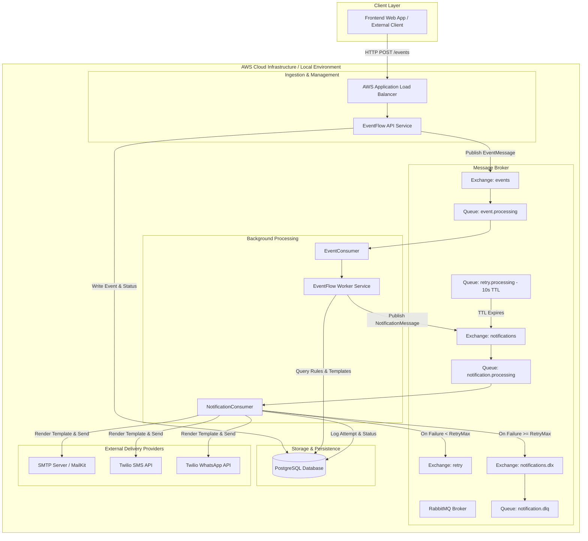

# EventFlow — Event-Driven Notification & Backend System

[](https://dotnet.microsoft.com/)
[](https://www.postgresql.org/)
[](https://www.rabbitmq.com/)
[](https://aws.amazon.com/ecs/)
[](https://www.docker.com/)

EventFlow is an enterprise-grade, multi-tenant event-driven notification engine built with **.NET 10**, **PostgreSQL**, **RabbitMQ**, and **AWS ECS Fargate**. It decouples application event publishing from multi-channel notification processing (Email, SMS, WhatsApp), providing custom rule evaluation, dynamic template rendering, automated retry mechanisms with dead-letter queue (DLQ) support, and role-based administration.

---

## Live Links & Quick References

- **Frontend Live Demo**: [https://event-flow-app-six.vercel.app/](https://event-flow-app-six.vercel.app/)
- **Backend Swagger (Production ALB)**: [http://eventflow-lb-669100954.ap-south-1.elb.amazonaws.com/swagger/index.html](http://eventflow-lb-669100954.ap-south-1.elb.amazonaws.com/swagger/index.html)
- **GitHub Repository**: [https://github.com/JindalMistry/EventFlow](https://github.com/JindalMistry/EventFlow)

---

## 1. Project Overview

### What EventFlow Is
EventFlow is a scalable, distributed backend infrastructure that ingests application events via REST APIs and asynchronously evaluates notification rules to deliver targeted messages across multiple delivery channels (Email via SMTP, SMS via Twilio, and WhatsApp via Twilio).

### What Problem It Solves
Monolithic applications often couple business logic with synchronous notification delivery, causing latency, delivery failures, and tightly coupled code. EventFlow solves this by:
- **Decoupling Ingestion & Delivery**: Client applications publish events via light HTTP calls and receive instant HTTP 200 responses while background worker services handle processing.
- **Multi-Tenant Isolation**: Registered applications operate independently with dedicated API keys, event definitions, notification rules, and provider settings.
- **Resilient Notification Delivery**: Failed deliveries automatically trigger timed retries using delayed RabbitMQ TTL queues before moving unrecoverable messages to a Dead-Letter Queue (DLQ).
- **Dynamic Content Formatting**: Templating engine renders dynamic notification payloads using placeholder substitution (`{{key}}`).

### Core Architecture Flow
1. **Client / External Application** sends an event payload to the API (`POST /events`) with header authentication (`X-API-Key`, `X-Application-Code`).
2. **API Service** validates the application and event definition, persists the `PublishedEvent` record to PostgreSQL, and publishes an `EventMessage` to the RabbitMQ `events` exchange.
3. **Worker Service (`EventConsumer`)** consumes the message from the `event.processing` queue, matches event rules, resolves configured templates, and enqueues corresponding `NotificationMessage` items into the `notifications` exchange.
4. **Worker Service (`NotificationConsumer`)** consumes notifications from `notification.processing`, executes dynamic template rendering, sends messages via SMTP or Twilio APIs, and logs delivery attempts to PostgreSQL.
5. In case of transient failure, the worker routes the message to the `retry` exchange (with a 10-second TTL delay) before re-queueing. Unrecoverable failures after maximum retry attempts are published to `notification.dlq`.

---

## 2. Key Features

Based on the implemented codebase:

- **Multi-Tenant Application Management**: Create, update, activate/deactivate applications, and issue/rotate API keys.
- **Role-Based Access Control (RBAC)**: Enforced via JWT authentication supporting `RootAdmin` and `ApplicationAdmin` user roles.
- **Event Ingestion Engine**: Ingest structured events via authenticated header endpoints (`X-API-Key`, `X-Application-Code`).
- **Dynamic Template Engine**: Custom template engine supporting dynamic variable substitution for body and subject fields across channels.
- **Multi-Channel Delivery Providers**:
  - **Email Provider**: SMTP delivery implemented via MailKit and MimeKit.
  - **SMS Provider**: Mobile SMS delivery implemented via Twilio REST API.
  - **WhatsApp Provider**: WhatsApp messaging implemented via Twilio Messaging API.
- **Automated Delayed Retries & DLQ**:
  - Delayed retries via dedicated RabbitMQ TTL queue (`x-message-ttl: 10000ms`).
  - Automatic escalation to Dead-Letter Queue (`notification.dlq`) upon exceeding configured retry thresholds.
- **Provider Connection Testing**: Dedicated endpoints (`POST /provider-configurations/{id}/test`) to verify provider credentials and connectivity without sending dummy user notifications.
- **Diagnostics & Structured Logging**: Integrated Serilog logging (Console & Daily Rolling File sink) and CloudWatch log drivers in containerized environments.
- **OpenAPI / Swagger Integration**: Interactive API documentation configured with JWT Bearer authentication scheme.

---

## 3. Architecture

### System Architecture Diagram



### AWS Infrastructure Details

The production infrastructure is deployed on AWS in the `ap-south-1` region:

- **AWS ECS (Elastic Container Service) with Fargate**: Serverless execution of `EventFlow-API` and `EventFlow-Worker` containers.
- **AWS ECR (Elastic Container Registry)**: Houses Docker images (`eventflow-api` and `eventflow-worker`).
- **AWS RDS (Relational Database Service)**: PostgreSQL database for persistent storage.
- **AWS Secrets Manager**: Securely injects database connection strings, JWT secrets, and RabbitMQ credentials directly into container environment variables at task startup.
- **AWS CloudWatch**: Collects log streams via `awslogs` driver (`/ecs/EventFlow-API` and `/ecs/api-worker`).
- **AWS Application Load Balancer (ALB)**: Routes inbound web traffic to ECS API tasks on port `8080`.
- **AWS IAM & OIDC**: GitHub Actions authenticates via AWS IAM OpenID Connect (`EventFlowGitHubActionsRole`) eliminating static AWS credentials in CI/CD.

---

## 4. Technology Stack

| Category | Technology | Version / Details |
| :--- | :--- | :--- |
| **Framework** | .NET / ASP.NET Core | `net10.0` (C# 13) |
| **Database** | PostgreSQL | `17` (ORM: Entity Framework Core `10.0.10`, Provider: `Npgsql.EntityFrameworkCore.PostgreSQL` `10.0.3`) |
| **Message Broker** | RabbitMQ | `4-management` (Client: `RabbitMQ.Client` `7.2.2`) |
| **Security & Auth** | JWT Bearer & BCrypt | `Microsoft.AspNetCore.Authentication.JwtBearer` `10.0.10`, `BCrypt.Net-Next` `4.2.0` |
| **Email Client** | MailKit & MimeKit | `4.17.0` |
| **Logging** | Serilog & CloudWatch | `Serilog.AspNetCore` `10.0.0`, `Serilog.Sinks.File` `7.0.0`, `awslogs` log driver |
| **API Documentation**| Swashbuckle / OpenAPI | `Swashbuckle.AspNetCore` `10.2.3` |
| **Containerization** | Docker & Docker Compose | Multi-stage Docker builds (`mcr.microsoft.com/dotnet/aspnet:10.0`) |
| **Cloud Platform** | AWS | ECS Fargate, ECR, RDS PostgreSQL, Secrets Manager, CloudWatch, ALB, IAM OIDC |

---

## 5. Repository / Folder Structure

```
EventFlow/
├── .github/
│   ├── ecs/
│   │   ├── api-task-definition.json       # AWS ECS task definition for API
│   │   └── worker-task-definition.json    # AWS ECS task definition for Worker
│   └── workflows/
│       └── deploy.yml                     # GitHub Actions CI/CD deployment pipeline
├── EventFlow.API/                         # Web API project
│   ├── Controllers/                       # API Endpoints (Auth, Apps, Events, Rules, Templates, etc.)
│   ├── Middleware/                        # Exception handling & custom middleware
│   ├── Program.cs                         # API entry point & DI configuration
│   └── Dockerfile                         # API multi-stage Docker build file
├── EventFlow.Application/                 # Application layer
│   ├── Common/                            # API response wrappers & query parameters
│   ├── DTOs/                              # Data Transfer Objects for requests/responses
│   ├── Exceptions/                        # Domain & application custom exceptions
│   └── Interfaces/                        # Contracts for services, repositories, and messaging
├── EventFlow.Domain/                      # Core Domain layer
│   ├── Entities/                          # Domain entities (User, Application, PublishedEvent, etc.)
│   └── Enums/                             # Domain enumerations (Channel, Status, Role, ProviderType)
├── EventFlow.Infrastructure/              # Infrastructure & Data layer
│   ├── Extensions/                        # Service registration extensions
│   ├── Messaging/RabbitMQ/                # RabbitMQ connection, publishers, and topology configuration
│   ├── Persistence/                       # EF Core DbContext, entity configurations, migrations
│   └── Services/                          # Service implementations & delivery providers (SMTP/Twilio)
├── EventFlow.Worker/                      # Background worker process
│   ├── Consumers/                         # BackgroundServices (EventConsumer, NotificationConsumer)
│   ├── Program.cs                         # Worker entry point
│   └── Dockerfile                         # Worker multi-stage Docker build file
├── .env                                   # Local environment variables template
├── docker-compose.yml                     # Runs full stack (PostgreSQL, RabbitMQ, API, Worker)
├── docker-compose.dependency.yml          # Runs dependencies only (PostgreSQL, RabbitMQ)
└── EventFlow.slnx                         # Solution file
```

---

## 6. Backend Local Setup

### Prerequisites
- **.NET 10 SDK** installed (`dotnet --version` >= 10.0.x)
- **Docker Desktop** installed and running
- **Git**

---

### Option A: Run Infrastructure in Docker + Run .NET Projects via Visual Studio / IDE

Use this mode when debugging or actively writing code in your IDE.

1. **Start Database and RabbitMQ Containers**:
   ```bash
   docker compose -f docker-compose.dependency.yml up -d
   ```

2. **Configure User Secrets for Local Development**:

   **API Project Secrets**:
   Set user secrets for `EventFlow.API` (Right-click project in VS -> *Manage User Secrets*, or execute in CLI):
   ```bash
   dotnet user-secrets set "ASPNETCORE_ENVIRONMENT" "Development" --project EventFlow.API
   dotnet user-secrets set "Jwt:Secret" "YOUR_DEVELOPMENT_JWT_SECRET_KEY_MINIMUM_32_BYTES" --project EventFlow.API
   dotnet user-secrets set "ConnectionStrings:DefaultConnection" "Host=localhost;Port=2506;Database=EventFlowDB;Username=postgres;Password=postgres" --project EventFlow.API
   dotnet user-secrets set "RabbitMQ:Host" "localhost" --project EventFlow.API
   dotnet user-secrets set "RabbitMQ:Port" "5672" --project EventFlow.API
   dotnet user-secrets set "RabbitMQ:Username" "eventflow" --project EventFlow.API
   dotnet user-secrets set "RabbitMQ:Password" "eventflow_rabbitmq" --project EventFlow.API
   ```

   **Worker Project Secrets**:
   Set user secrets for `EventFlow.Worker`:
   ```bash
   dotnet user-secrets set "ConnectionStrings:DefaultConnection" "Host=localhost;Port=2506;Database=EventFlowDB;Username=postgres;Password=postgres" --project EventFlow.Worker
   dotnet user-secrets set "RabbitMQ:Host" "localhost" --project EventFlow.Worker
   dotnet user-secrets set "RabbitMQ:Port" "5672" --project EventFlow.Worker
   dotnet user-secrets set "RabbitMQ:Username" "eventflow" --project EventFlow.Worker
   dotnet user-secrets set "RabbitMQ:Password" "eventflow_rabbitmq" --project EventFlow.Worker
   ```

3. **Apply Database Migrations**:
   ```bash
   dotnet ef database update --project EventFlow.Infrastructure --startup-project EventFlow.API
   ```

4. **Start API and Worker Services**:
   - Open `EventFlow.slnx` in Visual Studio, select Multiple Startup Projects (`EventFlow.API` and `EventFlow.Worker`), and press `F5`.
   - Or run from command line in separate terminals:
     ```bash
     # Terminal 1: API
     dotnet run --project EventFlow.API

     # Terminal 2: Worker
     dotnet run --project EventFlow.Worker
     ```

---

### Option B: Run Full System via Docker Compose

Use this mode to test the complete application containerized locally.

1. **Verify `.env` configuration**:
   Ensure `.env` exists in the repository root (or create one matching the required environment variables).

2. **Build and Launch All Containers**:
   ```bash
   docker compose up --build -d
   ```

3. **Verify Running Containers**:
   ```bash
   docker compose ps
   ```

---

### Verifying Local Setup

- **API Health Check**: `http://localhost:5000/health` (or `http://localhost:8080/health` in Docker) -> `{"status":"Healthy"}`
- **Swagger UI**: `http://localhost:5000/swagger/index.html` (or `http://localhost:8080/swagger/index.html`)
- **RabbitMQ Management Dashboard**: `http://localhost:15672` (Default credentials: `eventflow` / `eventflow_rabbitmq`)

---

## 7. Configuration

### Configuration Key Reference

| Configuration Key | Description | Environment Variable Equivalent | Safe Placeholder / Example |
| :--- | :--- | :--- | :--- |
| `ConnectionStrings:DefaultConnection` | PostgreSQL connection string | `ConnectionStrings__DefaultConnection` | `Host=localhost;Port=2506;Database=EventFlowDB;Username=postgres;Password=postgres` |
| `Jwt:Secret` | Secret key used to sign JWT tokens | `Jwt__Secret` | `<YOUR_SECURE_JWT_SECRET_KEY>` |
| `RabbitMQ:Host` | RabbitMQ server host address | `RabbitMQ__Host` | `localhost` (Local) / `rabbitmq` (Docker) |
| `RabbitMQ:Port` | RabbitMQ AMQP port | `RabbitMQ__Port` | `5672` |
| `RabbitMQ:Username` | RabbitMQ username | `RabbitMQ__Username` | `eventflow` |
| `RabbitMQ:Password` | RabbitMQ password | `RabbitMQ__Password` | `eventflow_rabbitmq` |

> [!IMPORTANT]
> **Secrets Management**: Never commit actual secrets or credentials to source control. In local development, use .NET User Secrets or uncommitted `.env` files. In AWS, credentials are securely stored in AWS Secrets Manager and injected dynamically into container tasks via ECS task definitions.

---

## 8. Database

- **Technology**: PostgreSQL 17 managed via EF Core (`Npgsql.EntityFrameworkCore.PostgreSQL`).
- **Database Name**: `EventFlowDB`
- **Port Mapping**: Container exposes port `5432` mapped to host port `2506` locally to avoid port conflicts with local PostgreSQL instances.
- **Migrations**: Located in `EventFlow.Infrastructure/Persistence/Migrations` (or `EventFlow.Infrastructure/Migrations`).

### Running Database Migrations

To apply pending EF Core migrations to the target PostgreSQL database:
```bash
dotnet ef database update --project EventFlow.Infrastructure --startup-project EventFlow.API
```

To create a new migration after modifying domain entities:
```bash
dotnet ef migrations add <MigrationName> --project EventFlow.Infrastructure --startup-project EventFlow.API
```

---

## 9. RabbitMQ Topology & Queues

EventFlow uses RabbitMQ to decouple API event ingestion from worker notification execution and to manage failure retries.

### Defined Topology

When the application boots, `RabbitMqTopologyInitializer` automatically declares the following exchanges, queues, and bindings:

```
[Exchange: events (Direct)]
   └── (RoutingKey: event.process) ──> [Queue: event.processing]
                                            └── Consumed by EventConsumer

[Exchange: notifications (Direct)]
   └── (RoutingKey: notification.process) ──> [Queue: notification.processing]
                                                    └── Consumed by NotificationConsumer

[Exchange: retry (Direct)]
   └── (RoutingKey: retry.process) ──> [Queue: retry.processing]
                                            ├── x-message-ttl: 10000 (10s delay)
                                            ├── x-dead-letter-exchange: notifications
                                            └── x-dead-letter-routing-key: notification.process

[Exchange: notifications.dlx (Direct)]
   └── (RoutingKey: notifications.dead) ──> [Queue: notification.dlq] (Dead-Letter Queue)
```

### Verifying RabbitMQ
Access the RabbitMQ Management Portal at `http://localhost:15672`. Navigate to the **Exchanges** and **Queues** tabs to view real-time message rates and queue metrics.

---

## 10. API Documentation

- **Local Development Swagger**: `http://localhost:5000/swagger/index.html` (or `http://localhost:8080/swagger/index.html`)
- **Production AWS ALB Swagger**: [http://eventflow-lb-669100954.ap-south-1.elb.amazonaws.com/swagger/index.html](http://eventflow-lb-669100954.ap-south-1.elb.amazonaws.com/swagger/index.html)

---

## 11. API Endpoints

Below is a complete list of endpoints implemented across API controllers:

### Authentication (`/auth`)
| Method | Route | Description | Auth Requirement |
| :--- | :--- | :--- | :--- |
| `POST` | `/auth/login` | Authenticate user and issue JWT token | Anonymous |
| `POST` | `/auth/change-password` | Change authenticated user password | Authorize |
| `GET` | `/auth/me` | Retrieve profile of authenticated user | Authorize |

### Application Management (`/applications`)
| Method | Route | Description | Auth Requirement |
| :--- | :--- | :--- | :--- |
| `POST` | `/applications` | Create new application tenant | `RootAdmin` |
| `GET` | `/applications` | List registered applications (paginated) | `RootAdmin` |
| `GET` | `/applications/{id}` | Get application details | `RootAdmin` |
| `PUT` | `/applications/{id}` | Update application details | `RootAdmin` |
| `DELETE` | `/applications/{id}` | Delete application | `RootAdmin` |
| `PATCH` | `/applications/{id}/activate` | Activate application tenant | `RootAdmin` |
| `PATCH` | `/applications/{id}/deactivate` | Deactivate application tenant | `RootAdmin` |
| `POST` | `/applications/{id}/rotate-api-key` | Generate new API key for application | `RootAdmin` |

### User Management (`/users`)
| Method | Route | Description | Auth Requirement |
| :--- | :--- | :--- | :--- |
| `GET` | `/users` | List system users (paginated) | `RootAdmin` |
| `GET` | `/users/{id}` | Get user details by ID | `RootAdmin` |
| `POST` | `/users` | Create new system user | `RootAdmin` |
| `PUT` | `/users/{id}` | Update user details | `RootAdmin` |
| `PATCH` | `/users/{id}/status` | Activate or deactivate user account | `RootAdmin` |
| `PATCH` | `/users/{id}/reset-password` | Administrative password reset | `RootAdmin` |
| `DELETE` | `/users/{id}` | Delete user account | `RootAdmin` |

### Event Definitions (`/event-definitions`)
| Method | Route | Description | Auth Requirement |
| :--- | :--- | :--- | :--- |
| `POST` | `/event-definitions` | Create event definition | `RootAdmin`, `ApplicationAdmin` |
| `GET` | `/event-definitions` | List event definitions (paginated) | `RootAdmin`, `ApplicationAdmin` |
| `GET` | `/event-definitions/{id}` | Get event definition details | `RootAdmin`, `ApplicationAdmin` |
| `PUT` | `/event-definitions/{id}` | Update event definition | `RootAdmin`, `ApplicationAdmin` |
| `PATCH` | `/event-definitions/{id}/activate` | Activate event definition | `RootAdmin`, `ApplicationAdmin` |
| `PATCH` | `/event-definitions/{id}/deactivate` | Deactivate event definition | `RootAdmin`, `ApplicationAdmin` |
| `DELETE` | `/event-definitions/{id}` | Delete event definition | `RootAdmin`, `ApplicationAdmin` |

### Event Publishing (`/events`)
| Method | Route | Description | Auth Requirement |
| :--- | :--- | :--- | :--- |
| `POST` | `/events` | Publish domain event payload | Headers: `X-API-Key`, `X-Application-Code` |

### Notification Rules (`/notification-rules`)
| Method | Route | Description | Auth Requirement |
| :--- | :--- | :--- | :--- |
| `POST` | `/notification-rules` | Create notification delivery rule | `ApplicationAdmin` |
| `GET` | `/notification-rules` | List notification rules | `ApplicationAdmin` |
| `GET` | `/notification-rules/{id}` | Get notification rule details | `ApplicationAdmin` |
| `PUT` | `/notification-rules/{id}` | Update notification rule | `ApplicationAdmin` |
| `PATCH` | `/notification-rules/{id}/enable` | Enable notification rule | `ApplicationAdmin` |
| `PATCH` | `/notification-rules/{id}/disable` | Disable notification rule | `ApplicationAdmin` |
| `DELETE` | `/notification-rules/{id}` | Delete notification rule | `ApplicationAdmin` |

### Notification Templates (`/notification-templates`)
| Method | Route | Description | Auth Requirement |
| :--- | :--- | :--- | :--- |
| `POST` | `/notification-templates` | Create notification content template | `ApplicationAdmin` |
| `GET` | `/notification-templates` | List notification templates | `ApplicationAdmin` |
| `GET` | `/notification-templates/{id}` | Get template details | `ApplicationAdmin` |
| `PUT` | `/notification-templates/{id}` | Update template content | `ApplicationAdmin` |
| `PATCH` | `/notification-templates/{id}/activate` | Activate notification template | `ApplicationAdmin` |
| `PATCH` | `/notification-templates/{id}/deactivate` | Deactivate notification template | `ApplicationAdmin` |
| `DELETE` | `/notification-templates/{id}` | Delete template | `ApplicationAdmin` |

### Provider Configurations (`/provider-configurations`)
| Method | Route | Description | Auth Requirement |
| :--- | :--- | :--- | :--- |
| `POST` | `/provider-configurations` | Configure delivery provider (SMTP/Twilio) | `RootAdmin`, `ApplicationAdmin` |
| `GET` | `/provider-configurations` | List provider configurations | `RootAdmin`, `ApplicationAdmin` |
| `GET` | `/provider-configurations/{id}` | Get provider configuration | `RootAdmin`, `ApplicationAdmin` |
| `PUT` | `/provider-configurations/{id}` | Update provider configuration | `RootAdmin`, `ApplicationAdmin` |
| `PATCH` | `/provider-configurations/{id}/enable` | Enable provider configuration | `RootAdmin`, `ApplicationAdmin` |
| `PATCH` | `/provider-configurations/{id}/disable` | Disable provider configuration | `RootAdmin`, `ApplicationAdmin` |
| `POST` | `/provider-configurations/{id}/test` | Execute connectivity test for provider | `RootAdmin`, `ApplicationAdmin` |

### System & Diagnostics (`/health`, `/api/test/rabbitmq`)
| Method | Route | Description | Auth Requirement |
| :--- | :--- | :--- | :--- |
| `GET` | `/health` | System health check endpoint | Anonymous |
| `POST` | `/api/test/rabbitmq/publish` | Test endpoint to publish dummy RabbitMQ event | Anonymous |

---

## 12. Worker Process

The `EventFlow.Worker` service runs as a background process (`Host.CreateApplicationBuilder`) hosting two dedicated consumer services:

1. **`EventConsumer`**:
   - Listens on `event.processing`.
   - Reads published event messages, invokes `IEventProcessor` to evaluate active `NotificationRule` records, creates `Notification` entities, and publishes `NotificationMessage` payloads to `notifications`.

2. **`NotificationConsumer`**:
   - Listens on `notification.processing`.
   - Fetches target template and provider credentials, executes template payload rendering, resolves provider implementation via `INotificationProviderFactory`, and dispatches message.
   - **Retry Handling**: On transient failure, if `attemptNumber < rule.RetryCount`, publishes message to `retry` exchange (10-second TTL delay).
   - **DLQ Escalation**: If max retries are reached, publishes message to `notifications.dlx` exchange -> `notification.dlq`.

---

## 13. Logging

- **Local Logging**: Serilog writes structured log events to Console and daily rolling files stored under `Logs/log-.txt`.
- **AWS Logging**: Container logs are captured via the `awslogs` log driver and forwarded directly to AWS CloudWatch Log Groups:
  - API Logs: `/ecs/EventFlow-API`
  - Worker Logs: `/ecs/api-worker`

---

## 14. Docker

### Multi-Stage Dockerfiles
Both `EventFlow.API/Dockerfile` and `EventFlow.Worker/Dockerfile` utilize optimized multi-stage build manifests based on `mcr.microsoft.com/dotnet/aspnet:10.0` runtime and `mcr.microsoft.com/dotnet/sdk:10.0` build images.

### Building Docker Images Locally
```bash
# Build API Image
docker build -f EventFlow.API/Dockerfile -t eventflow-api:latest .

# Build Worker Image
docker build -f EventFlow.Worker/Dockerfile -t eventflow-worker:latest .
```

---

## 15. AWS Deployment Architecture

```
                               ┌────────────────────────────────────────────────────────┐
                               │                    GitHub Actions                      │
                               │           Branch: release/* or dispatch                │
                               └──────────────────────────┬─────────────────────────────┘
                                                          │
                                         Authenticate via AWS IAM OIDC
                                       Role: EventFlowGitHubActionsRole
                                                          │
                                      ┌───────────────────┴───────────────────┐
                                      ▼                                       ▼
                             Build & Tag API Image                  Build & Tag Worker Image
                                      │                                       │
                                      └───────────────────┬───────────────────┘
                                                          │ Push Images
                                                          ▼
                                              AWS ECR (ap-south-1)
                                      ┌───────────────────┴───────────────────┐
                                      ▼                                       ▼
                            eventflow-api:${SHA}                    eventflow-worker:${SHA}
                                      │                                       │
                                      └───────────────────┬───────────────────┘
                                                          │ Render Task Definitions
                                                          ▼
                                                 AWS ECS (Fargate)
                                                    Cluster: EventFlow
                                      ┌───────────────────┴───────────────────┐
                                      ▼                                       ▼
                                 Service: API                          Service: Worker
                              Task: EventFlow-API                    Task: EventFlow-Worker
```

---

## 16. CI/CD Pipeline

The repository includes a GitHub Actions automated CI/CD pipeline (`.github/workflows/deploy.yml`):

- **Trigger**: Pushes to `release/*` branches or manual trigger via `workflow_dispatch`.
- **Authentication**: Keyless authentication via **GitHub OIDC** assuming `arn:aws:iam::668774618445:role/EventFlowGitHubActionsRole`.
- **Build & Push**: Builds Docker images tagged with commit SHA (`${{ github.sha }}`) and pushes to AWS ECR.
- **ECS Deployment**:
  - Renders new task definitions using `aws-actions/amazon-ecs-render-task-definition@v1`.
  - Deploys updated task definitions to ECS cluster `EventFlow` using `aws-actions/amazon-ecs-deploy-task-definition@v2`.
  - Verifies service stability (`wait-for-service-stability: true`).

---

## 17. Environment Variables Reference

Below is a reference table of required environment variables for deployment:

| Variable Name | Purpose | Safe Example Value |
| :--- | :--- | :--- |
| `ASPNETCORE_ENVIRONMENT` | ASP.NET Core environment mode | `Development` / `Production` |
| `ASPNETCORE_URLS` | Binding URLs for API service | `http://+:8080` |
| `ConnectionStrings__DefaultConnection` | Database connection string | `Host=...;Port=5432;Database=EventFlowDB;Username=...;Password=...` |
| `Jwt__Secret` | JWT secret signing key | `<SECURE_RANDOM_STRING_MIN_32_CHARS>` |
| `RabbitMQ__Host` | RabbitMQ server hostname | `rabbitmq` / `localhost` |
| `RabbitMQ__Port` | RabbitMQ server AMQP port | `5672` |
| `RabbitMQ__Username` | RabbitMQ username | `eventflow` |
| `RabbitMQ__Password` | RabbitMQ password | `eventflow_rabbitmq` |

---

## 18. Frontend & Live Demo Links

- **Frontend Live App**: [https://event-flow-app-six.vercel.app/](https://event-flow-app-six.vercel.app/)
- **Backend Swagger Endpoint**: [http://eventflow-lb-669100954.ap-south-1.elb.amazonaws.com/swagger/index.html](http://eventflow-lb-669100954.ap-south-1.elb.amazonaws.com/swagger/index.html)
- **GitHub Repository**: [https://github.com/JindalMistry/EventFlow](https://github.com/JindalMistry/EventFlow)

---

## 19. Testing

- **Current Repository State**: The current solution (`EventFlow.slnx`) contains core service projects (`API`, `Application`, `Domain`, `Infrastructure`, `Worker`). Dedicated test projects (e.g. xUnit/NUnit unit or integration test projects) can be added as needed.
- **Running Automated Tests**: Once test projects are added, execute:
  ```bash
  dotnet test
  ```
- **Manual Verification & Testing Endpoints**:
  - Test RabbitMQ publishing: `POST /api/test/rabbitmq/publish`
  - Test Notification Providers: `POST /provider-configurations/{id}/test`
  - System Health Status: `GET /health`

---

## 20. Troubleshooting

| Issue | Potential Cause | Resolution |
| :--- | :--- | :--- |
| **API cannot connect to PostgreSQL** | PostgreSQL container not running or incorrect port configuration. | Verify container status with `docker ps`. Ensure host port is mapped to `2506` locally or check connection string in secrets. |
| **API cannot connect to RabbitMQ** | RabbitMQ broker offline or authentication failed. | Check RabbitMQ status via `http://localhost:15672`. Confirm `RabbitMQ:Username` and `RabbitMQ:Password` match `.env` or user secrets. |
| **Worker cannot consume messages** | RabbitMQ topology not initialized or worker configuration mismatch. | Ensure `EventFlow.API` or `RabbitMqTopologyInitializer` has run to declare exchanges and queues. Check worker console logs. |
| **Swagger UI unavailable** | Application environment not configured or container port binding issue. | Verify container maps port `8080`. Check health endpoint at `/health`. |
| **Docker build failures** | Missing SDK dependencies or context path error. | Run Docker commands from the root solution folder so project references resolve correctly. |
| **ECS task failing to start** | Invalid Secrets Manager ARN or database connection string timeout. | Inspect CloudWatch log groups (`/ecs/EventFlow-API` or `/ecs/api-worker`). Verify Secrets Manager permission in ECS task execution role. |

---

## 21. Security Notes

- **Secrets Isolation**: Secrets are never hardcoded or committed to git repository files.
- **AWS Secrets Manager**: Injected securely at ECS container launch time.
- **Keyless CI/CD Authentication**: Uses AWS IAM OIDC federation instead of static AWS credentials.
- **API Key Security**: Application API keys can be revoked or rotated instantly via `POST /applications/{id}/rotate-api-key`.
- **Password Security**: Password storage protected using BCrypt hashing (`BCrypt.Net-Next`).

---

## 22. Future Improvements (Roadmap)

The following capabilities are candidate enhancements for future iterations:

- [ ] **Automated Test Suite**: Implement unit test suites (xUnit, Moq) and integration test suites (Testcontainers for PostgreSQL & RabbitMQ).
- [ ] **Webhook Channel Provider**: Add Webhook notification delivery provider for HTTP callback notifications.
- [ ] **API Rate Limiting & Throttling**: Add middleware rate limiting to guard event publication endpoints against burst traffic spikes.
- [ ] **Real-time Admin Dashboard**: Build real-time metric tracking for message queues and delivery success rates via WebSockets / SignalR.

---

## 23. License

This repository is maintained for demonstration and portfolio purposes. All rights reserved.

---

*Documentation maintained for EventFlow repository.*